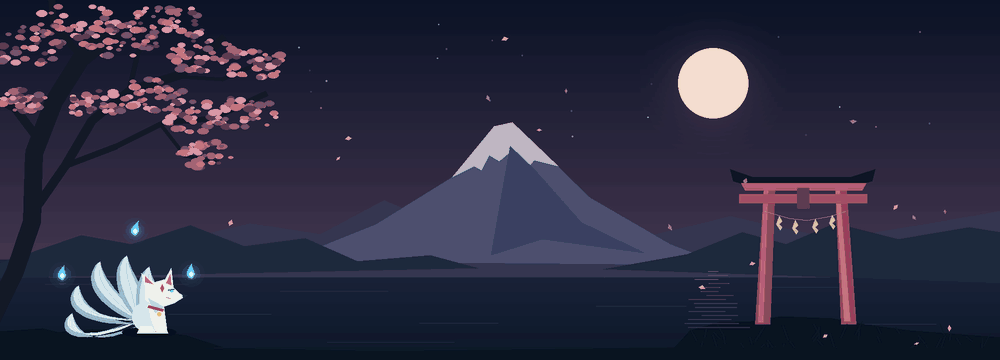

<div align="center">

# Aloka Warnakula

**The Simpler The Better**

<br>

<picture>
  <source media="(prefers-reduced-motion: reduce)" srcset="assets/moonlit-japan.png">
  
</picture>

</div>

<br>

<details>
<summary><strong>Can you crack this?</strong></summary>

```text
173132132145150210212148201197146200132200216165132168197132162150132214218205201197210202201201165208146148214215132132214176132173132218174209132205132132221201197152210214171197187165177197210208208132173212201148205210201153132132132132150132214197205169208179216209183201174165145202201132197176
```

**Decryption key**

```text
42-82-68-86-92-32-18-95-79-69-94-33-76-53-37-60-66-77-8-44-88-90-71-78-73-27-40-46-43-84-22-20-14-29-97-98-28-23-6-41-75-62-25-0-13-57-16-70-15-3-61-1-12-65-17-96-49-10-26-80-2-31-7-19-21-39-5-30-67-47-74-91-63-52-36-93-34-50-85-54-99-89-9-11-56-72-4-83-38-81-35-24-45-51-87-64-58-59-48-55
```

</details>

<br>

<div align="center">

<picture>
  <source media="(prefers-color-scheme: dark)" srcset="https://raw.githubusercontent.com/AlokaWarnakula/AlokaWarnakula/output/github-contribution-grid-snake-dark.svg">
  <source media="(prefers-color-scheme: light)" srcset="https://raw.githubusercontent.com/AlokaWarnakula/AlokaWarnakula/output/github-contribution-grid-snake.svg">
  
</picture>

</div>
